# Wazuh SIEM Home Lab

A fully functional SIEM (Security Information and Event Management) home lab built on Hyper-V, monitoring real endpoints across Windows and Linux using Wazuh 4.14.4.

## Overview

This project deploys Wazuh; an open-source XDR and SIEM platform, on a Hyper-V virtual machine running Ubuntu Server 22.04. The server collects and analyzes security telemetry from multiple endpoints on my home network, including a Windows 11 workstation and a Raspberry Pi 4 running Pi-hole, WireGuard VPN, and other network services (with plans to add my MacBook).

The lab demonstrates real-world SIEM capabilities: centralized log collection, vulnerability detection, MITRE ATT&CK mapping, CIS benchmark compliance scanning, and file integrity monitoring.

## Architecture

```
┌──────────────────────────────────────────────────────────────┐
│                     Home Network (<NETWORK-SUBNET>)          │
│                                                              │
│  ┌─────────────────────┐     ┌─────────────────────────────┐ │
│  │  Windows 11 PC      │     │  Raspberry Pi 4             │ │
│  │  <WINDOWS-PC-IP>    │     │  <RASPBERRY-PI-IP>          | │
│  │  Wazuh Agent 4.14.4 │     │  Wazuh Agent 4.14.4         │ │
│  │                     │     │  Pi-hole + WireGuard VPN    │ │
│  │  Monitored:         │     │  + Unbound + Nextcloud      │ │
│  │  - Windows Events   │     │  + Fail2Ban                 │ │
│  │  - Vulnerability    │     │                             │ │
│  │    Detection        │     │  Monitored:                 │ │
│  │  - CIS Benchmarks   │     │  - Auth logs                │ │
│  │  - File Integrity   │     │  - Syslog                   │ │
│  └────────┬────────────┘     │  - CIS Benchmarks           │ │
│           │                  │  - File Integrity           │ │
│           │                  └──────────┬────────────────────┘ 
│           │                             │                    │
│           └──────────┬──────────────────┘                    │
│                      │                                       │
│           ┌──────────▼──────────┐                            │
│           │  Wazuh Server (VM)  │                            │
│           │  <WAZUH-SERVER-IP>  │                            │
│           │  Ubuntu Server 22.04│                            │
│           │  Hyper-V Gen 2 VM   │                            │
│           │                     │                            │
│           │  - Wazuh Manager    │                            │
│           │  - Wazuh Indexer    │                            │
│           │  - Wazuh Dashboard  │                            │
│           │  - Filebeat         │                            │
│           └─────────────────────┘                            │
└──────────────────────────────────────────────────────────────┘
```

## VM Specifications

| Component | Specification |
|-----------|--------------|
| Hypervisor | Hyper-V (Windows 11 Pro) |
| Generation | Gen 2 (UEFI, Secure Boot) |
| RAM | 8 GB |
| vCPUs | 4–6 |
| Disk | 80 GB VHDX (dynamically expanding) |
| Network | External Virtual Switch (Intel I219-V) |
| OS | Ubuntu Server 22.04 LTS |
| Storage Path | D:\Hyper-V-VMs\Wazhuh-Server |

## Setup Process

### 1. Create the Hyper-V Virtual Machine

Created a Gen 2 VM in Hyper-V Manager with 8 GB RAM, 4+ vCPUs, and an 80 GB virtual hard disk on the D: drive. Attached the Ubuntu Server 22.04 ISO and configured the external virtual switch (vExternal) bound to the physical Ethernet adapter for full network access.

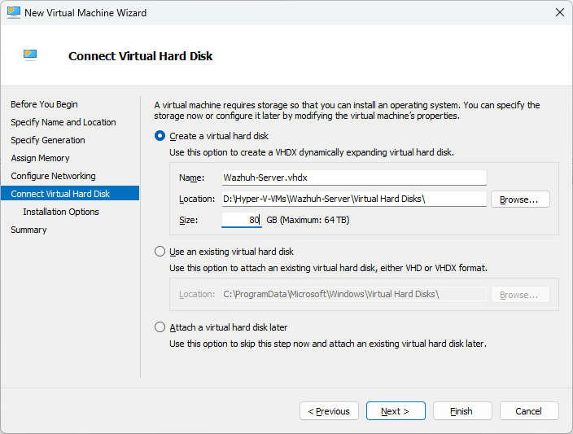

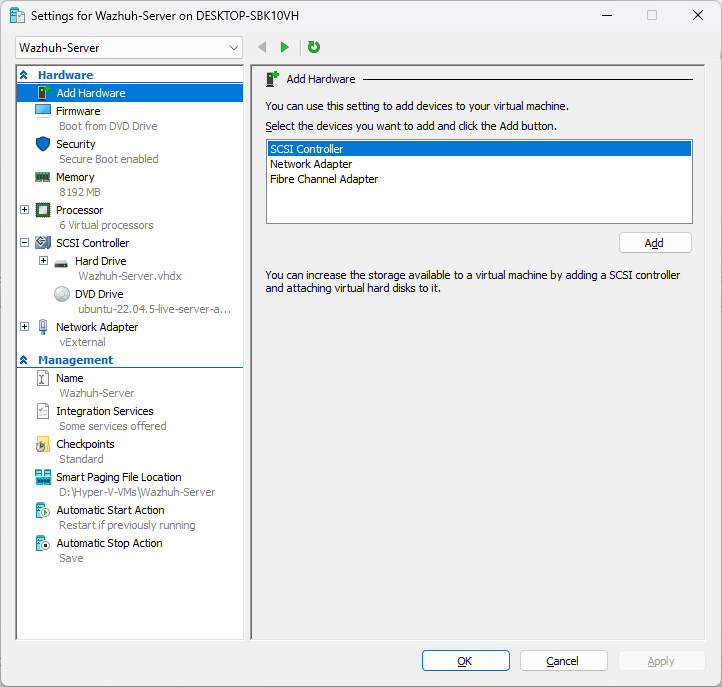

### 2. Install Ubuntu Server

Installed Ubuntu Server 22.04 with default settings, OpenSSH enabled, and LVM storage on the 80 GB virtual disk.

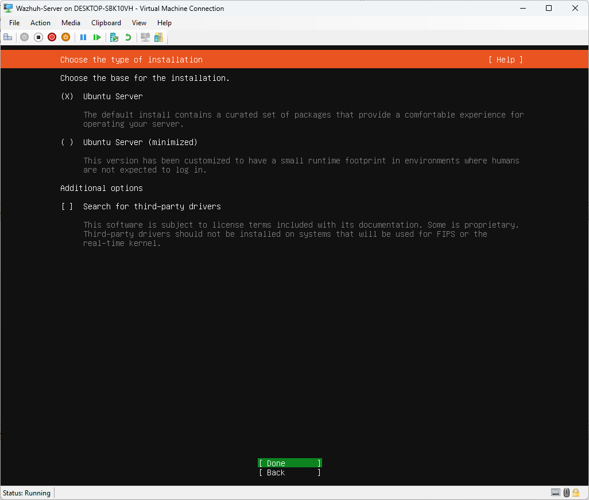

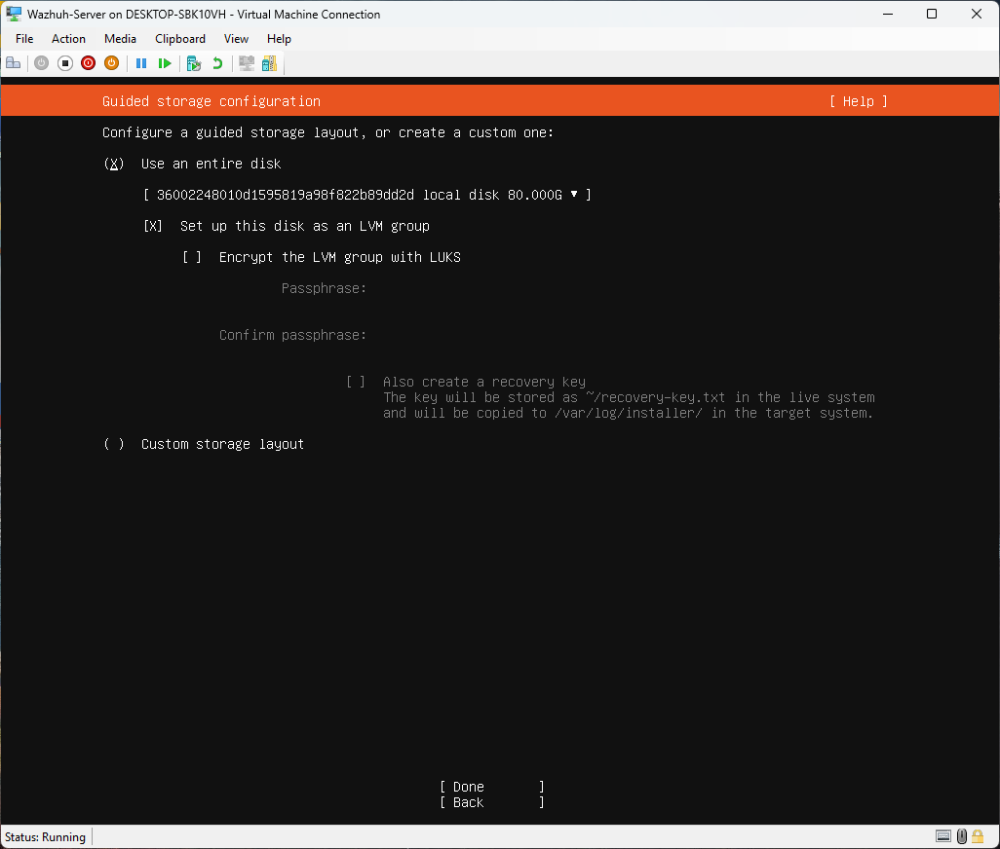

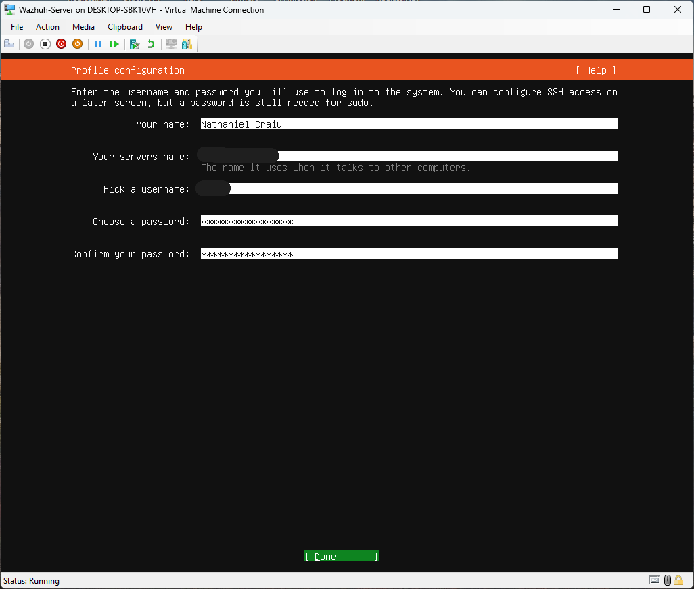

### 3. Install Wazuh (All-in-One)

Ran the Wazuh installation assistant, which deploys the indexer, server, and dashboard on a single node:

```bash
curl -s -o wazuh-install.sh https://packages.wazuh.com/4.14/wazuh-install.sh
sudo bash ./wazuh-install.sh -a
```

The installer generates SSL certificates, configures all components, and outputs the admin credentials for the web dashboard.

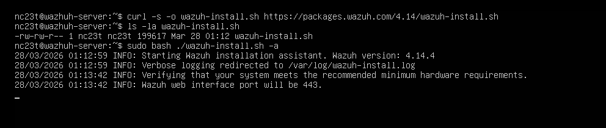

### 4. Access the Dashboard

After installation, the Wazuh dashboard is accessible at `https://<VM-IP>:443`. First login uses the auto-generated admin credentials from the installer output.

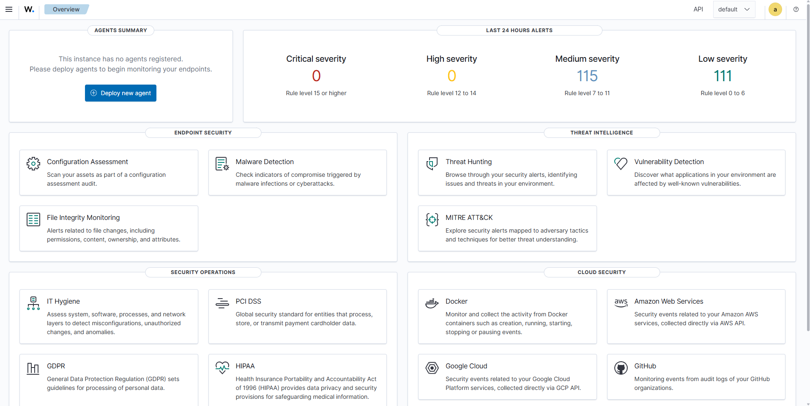

### 5. Deploy Wazuh Agent — Raspberry Pi

Installed the Wazuh agent on the Pi by adding the Wazuh repository and pointing the agent to the manager:

```bash
# Import GPG key
curl -s https://packages.wazuh.com/key/GPG-KEY-WAZUH | sudo gpg --no-default-keyring \
  --keyring gnupg-ring:/usr/share/keyrings/wazuh.gpg --import && \
  sudo chmod 644 /usr/share/keyrings/wazuh.gpg

# Add repository
echo "deb [signed-by=/usr/share/keyrings/wazuh.gpg] https://packages.wazuh.com/4.x/apt/ stable main" | \
  sudo tee /etc/apt/sources.list.d/wazuh.list

# Install agent
sudo apt update
WAZUH_MANAGER="<WAZUH-SERVER-IP>" sudo apt install wazuh-agent -y

# Start agent
sudo systemctl daemon-reload
sudo systemctl enable wazuh-agent
sudo systemctl start wazuh-agent
```

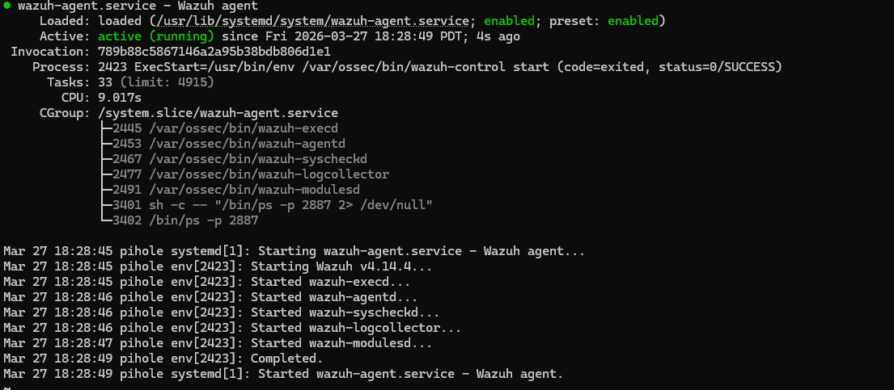

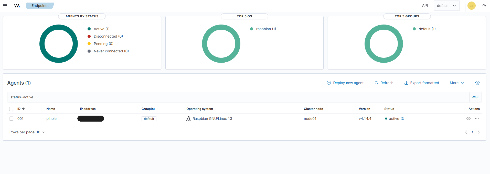

### 6. Deploy Wazuh Agent — Windows 11

Downloaded and installed the Wazuh agent MSI on the Windows workstation via PowerShell:

```powershell
# Download the agent installer
Invoke-WebRequest -Uri https://packages.wazuh.com/4.x/windows/wazuh-agent-4.14.4-1.msi `
  -OutFile "$HOME\Downloads\wazuh-agent.msi"

# Install with manager IP
msiexec.exe /i "$HOME\Downloads\wazuh-agent.msi" WAZUH_MANAGER="<WAZUH-SERVER-IP>"

# Start the service
net start WazuhSvc
```

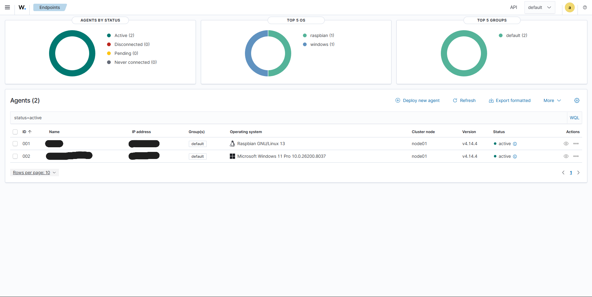

## Results

### Vulnerability Detection

Wazuh immediately identified **73 critical vulnerabilities** on the Windows workstation by cross-referencing installed software against the CVE database. The majority (69/73) were attributed to an outdated Mozilla Firefox installation.

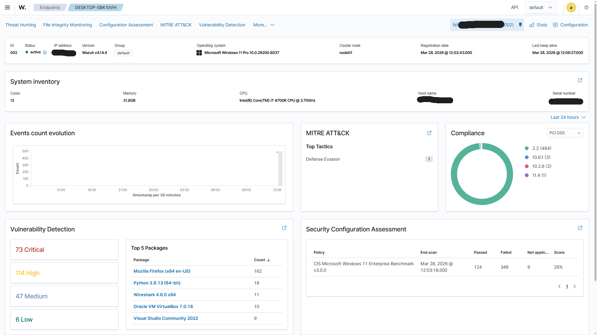

**Remediation steps taken:**
- Uninstalled outdated Firefox (69 critical CVEs eliminated)
- Verified Python and Node.js were on current versions
- Remaining vulnerabilities tracked for Wireshark, VirtualBox, Visual Studio, and Steam updates

### Raspberry Pi Agent Analysis

The Pi agent revealed MITRE ATT&CK activity across multiple tactic categories (Defense Evasion, Initial Access, Persistence, Privilege Escalation, Lateral Movement) and ran CIS Distribution Independent Linux Benchmark compliance scans.

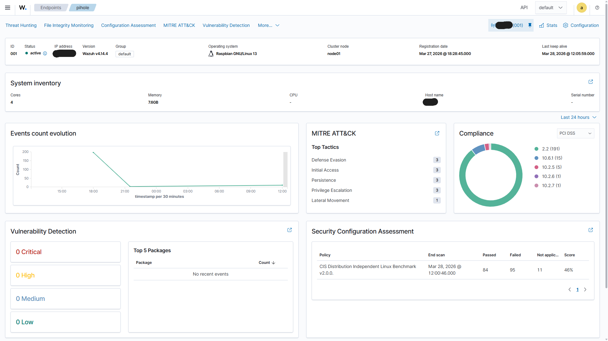

### CIS Compliance Scanning

| Endpoint | Benchmark | Passed | Failed | Score |
|----------|-----------|--------|--------|-------|
| Windows 11 PC | CIS Microsoft Windows 11 Enterprise v3.0.0 | 124 | 349 | 26% |
| Raspberry Pi | CIS Distribution Independent Linux v2.0.0 | 84 | 95 | 46% |

## Troubleshooting Notes

**DNS resolution on the VM:** After installing Ubuntu Server on Hyper-V, the VM had network connectivity (could ping by IP) but DNS resolution failed. `systemd-resolved` was not configured with upstream DNS servers. Fixed by creating `/etc/systemd/resolved.conf.d/dns.conf` with Google DNS (8.8.8.8, 8.8.4.4) and restarting the service. This is a common issue with Hyper-V VMs on external virtual switches.

**Wazuh agent manager IP not set:** When installing the agent with `WAZUH_MANAGER` as an environment variable, `sudo` can strip environment variables. If the agent config shows `MANAGER_IP` instead of the actual IP, manually edit `/var/ossec/etc/ossec.conf` (Linux) or `C:\Program Files (x86)\ossec-agent\ossec.conf` (Windows) and replace `MANAGER_IP` with the server's IP address.

## Technologies Used

- **Wazuh 4.14.4** — Open-source SIEM/XDR platform
- **Ubuntu Server 22.04 LTS** — Wazuh server OS
- **Hyper-V** — Type 1 hypervisor (Windows 11 Pro)
- **Raspberry Pi OS (Debian 13)** — Linux endpoint
- **Windows 11 Pro** — Windows endpoint

## Grafana Integration

After getting the Wazuh stack fully operational, I added Grafana on top of the existing VM to build custom visualization dashboards on top of the data Wazuh was already collecting. The idea was to get hands-on with the kind of multi-tool SIEM workflow you'd see in a real SOC, where analysts often pair their SIEM with a separate visualization layer for custom monitoring views.

### Why Grafana on Top of Wazuh

The Wazuh dashboard is good out of the box, but it's pre-built and rough. Grafana lets me query the underlying Wazuh Indexer (OpenSearch) directly and build whatever panels I want. Same data, more flexibility. In a real environment, this is useful for things like NOC-style monitoring screens, custom alerting, or combining Wazuh data with metrics from other sources down the line.

### Installation

Installed Grafana OSS on the same Ubuntu VM as Wazuh, since OpenSearch is already running locally on port 9200. No reason to add network overhead by putting Grafana on a separate machine for a home lab.

```bash
sudo apt install -y apt-transport-https software-properties-common wget
sudo mkdir -p /etc/apt/keyrings/
wget -q -O - https://apt.grafana.com/gpg.key > /tmp/grafana.key
cat /tmp/grafana.key | gpg --dearmor | sudo tee /etc/apt/keyrings/grafana.gpg > /dev/null
echo "deb [signed-by=/etc/apt/keyrings/grafana.gpg] https://apt.grafana.com stable main" | \
  sudo tee /etc/apt/sources.list.d/grafana.list
sudo apt update
sudo apt install grafana -y
sudo systemctl daemon-reload
sudo systemctl enable grafana-server
sudo systemctl start grafana-server
```

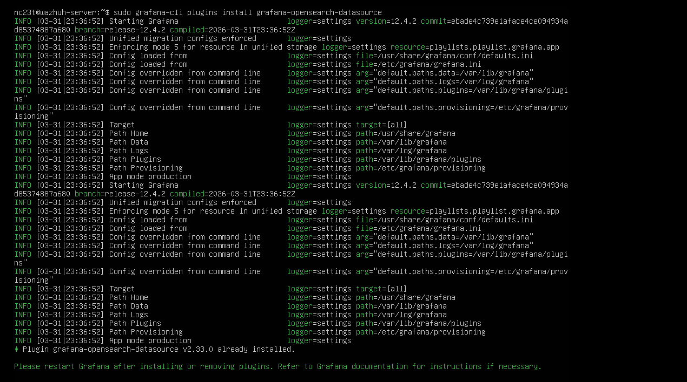

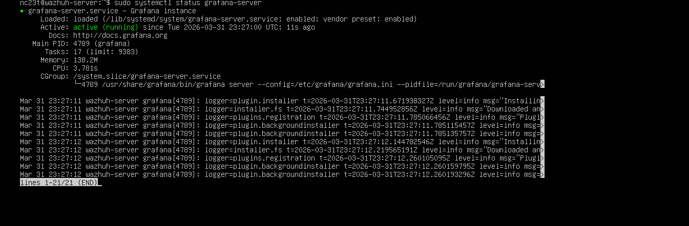

### Connecting Grafana to OpenSearch

Grafana needs an OpenSearch data source plugin to talk to the Wazuh Indexer. Installed it via the Grafana CLI and restarted the service.

```bash
sudo grafana-cli plugins install grafana-opensearch-datasource
sudo systemctl restart grafana-server
```

Then configured the data source in the Grafana UI, pointing to `https://localhost:9200`, with basic auth using the Wazuh admin credentials, Skip TLS Verify enabled (self-signed cert), and the index pattern set to `wazuh-alerts-*`.

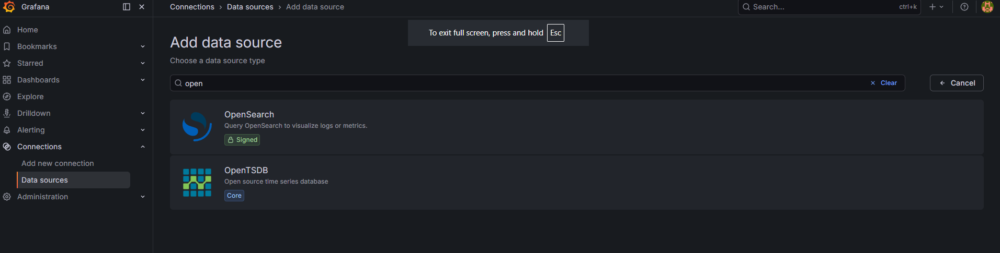

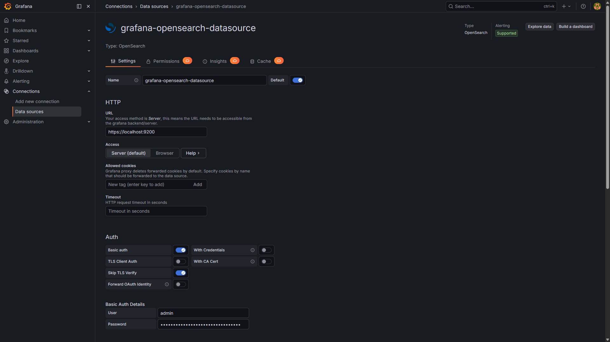

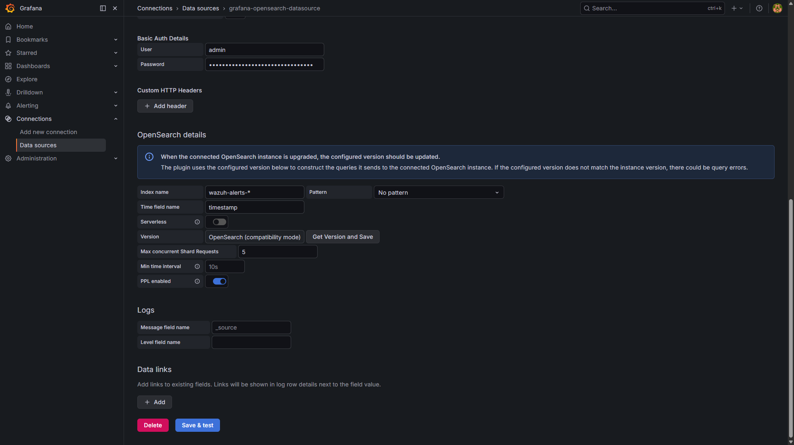

### Building the Dashboard

Created a custom dashboard called "Wazuh SIEM Overview" with panels for tracking alert volume and trends across all monitored agents.

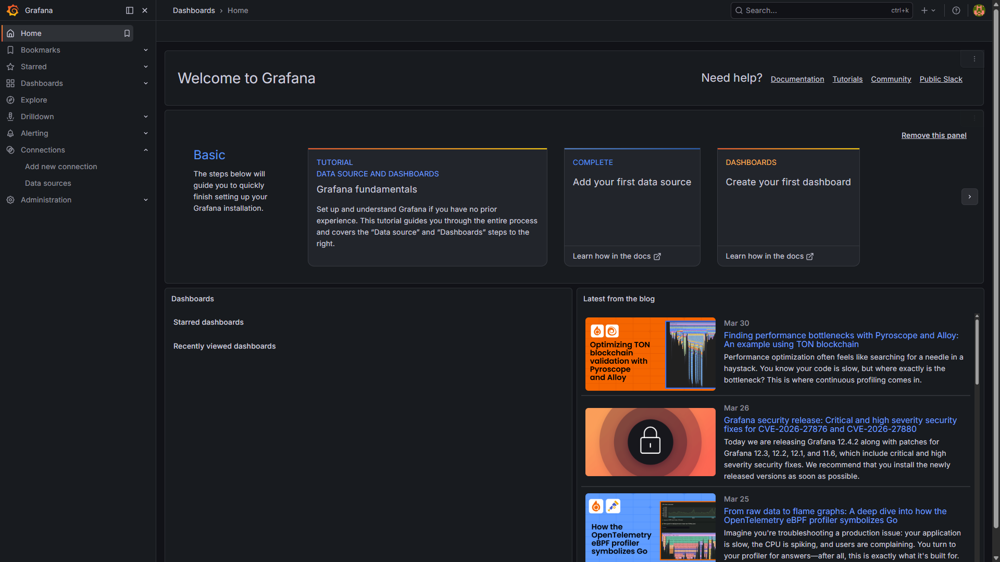

**Panel 1: Security Events Over Time** — A time series visualization showing alert volume across all agents. Uses a Lucene query of `*` (match everything), counted and grouped by a Date Histogram on the `timestamp` field. The spike around late March lines up exactly with when I deployed the agents and they started reporting in.

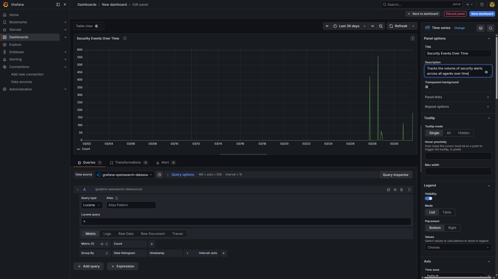

**Panel 2: Total Alerts** — A Stat panel showing the total event count across the entire environment as a single big number. Quick at-a-glance volume metric, the same kind you'd see on a NOC display.

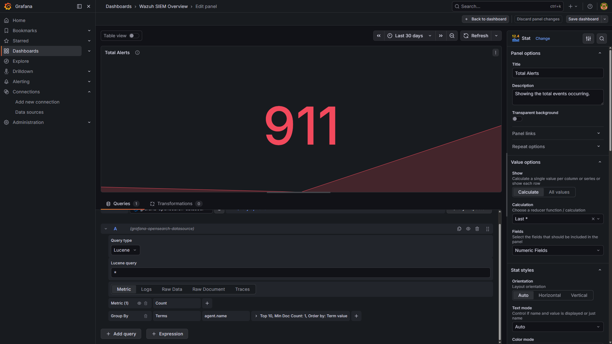


## Future Updates

I plan to add many more visually pleasing (and useful) panels. This is just the beginning, but I like the way that it came out so far.

### Troubleshooting Notes

**Field name issues with `agent.name`:** When trying to build an "Alerts by Agent" pie chart, queries kept returning empty results. The issue was that Wazuh's OpenSearch indices use `.keyword` subfields for exact matching on text fields, but even `agent.name.keyword` didn't return data in my setup. Going to revisit this and inspect the actual index mapping with the OpenSearch `_search` API to find the exact field path.

**Hyper-V console clipboard:** The default Hyper-V Virtual Machine Connection window doesn't support paste from the host clipboard, which made typing long curl commands painful. Fixed this by switching to SSH from the host PowerShell instead, which gives full clipboard support and is a better workflow regardless.


